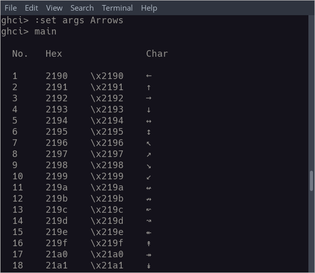
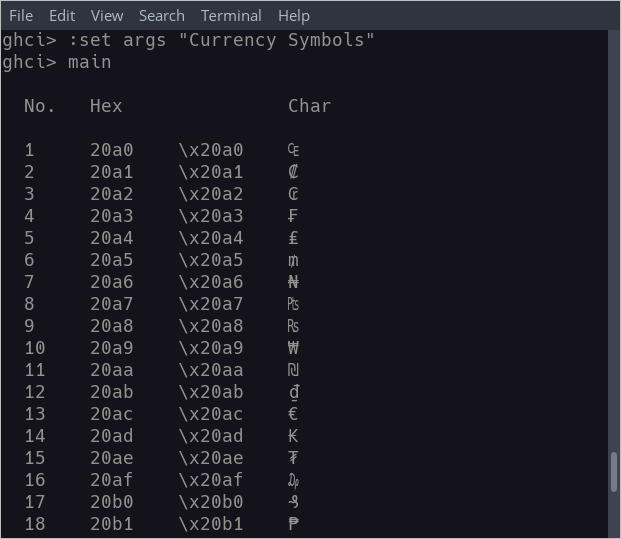

# Unicode Tables 

## Overview 

This handy utility outputs Unicode character range tables. 
Each hexadecimal escape sequence along with the associated
character itself is rendered. A full list of Unicode character 
ranges are listed in the `data/ranges.txt` file. 

This tool can be a quick reference for discovering
particular Unicode escape sequences required for 
development projects.

To load a particular range, provide the range's name - exactly
as specified in `data/ranges.txt` - as a command-line argument.
For example, in GHCI:

```bash
:set args Katakana
main

# wrap name in double-quotes if multiple words
:set args "Currency Symbols"
main
```

See screenshots below for sample output.

## Important

In order for particular character ranges to render, you will
need to have the appropriate fonts installed on your system.

For example, to render the **Katakana** character range, you 
will need a Japanese font installed on your system.

## Screenshots 





